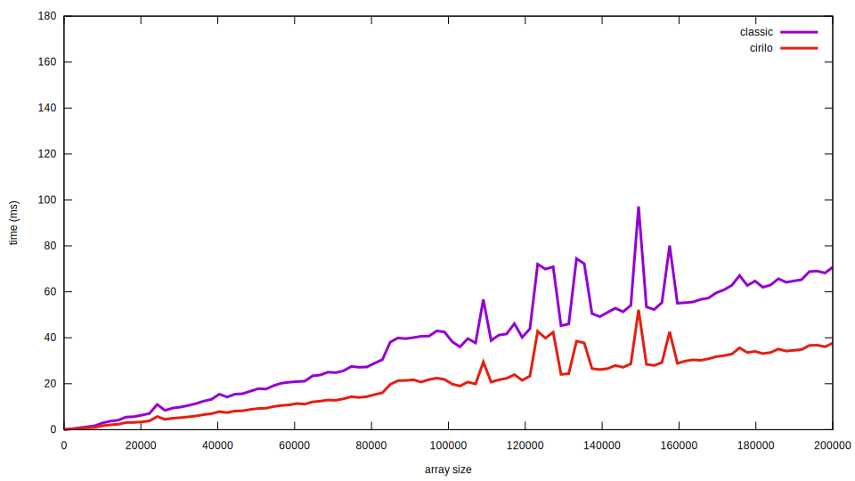

# Cirilo's algorithm
> An overkill algorithm for those in a hurry

The following is a description of a&ndash;as far as I know&ndash;new solution for the [Smallest Difference pair of values between two unsorted Arrays](https://www.geeksforgeeks.org/smallest-difference-pair-values-two-unsorted-arrays) problem.

## Disclaimer

I'm claiming the following algorithm as mine because I couldn't find it elsewhere. If you've implemented it before me, please let me know.

## The problem

Simply stated, the problem consists of given two arrays of integers, **A** and **B** of size **m** and **n** respectively, find the pair of numbers **(A<sub>i</sub>, B<sub>j</sub>)** with the smallest difference between them.

So, given:

```
A = [1, 12, 150]
B = [32, -20, 11, 8]
```

The solution would be the array:
```
[12, 11]
```

### Classic solution

The solution proposed on GeeksforGeeks and others resources is based on sorting both arrays, and then finding the smallest pair using two pointers logic with linear complexity. The overall solution has a time complexity of **O(m*log(m) + n\*log(n))** and space complexity of **O(1)**.

The solution in pseudocode can be found below:

``` c
find(A, B) {
	A.sort()
	B.sort()

	a = 0
	b = 0

	smallestPair = [A[0], B[0]]

	while (a < A.length && b < B.length) {
		if (abs(A[a] - B[b]) < abs(smallestPair[0] - smallestPair[1]))
			smallestPair = [A[a],  B[b]]

		if (A[a] < B[b])
			a++
		else
			b++
	}

	return smallestPair
}
```

### Cirilo's algorithm

My solution sorts only the smallest array, taking **O(m\*log(m))**. 

After that, it computes and save in a hash map all the smallest possible pairs between every number in the array and all integers between **min(A)** and **max(A)**, that being the minimum and maximum value contained in the array. All of that can be done in **O(max(A) - min(A))**.

So if, after sorted, we had ``A = [-2, 5, 9, 12]`` we would create the following map:

``` c
[
	-2 -> -2,
	-1 -> -2,
	 0 -> -2,
	 1 -> -2,
	 2 ->  5,
	 3 ->  5,
	 4 ->  5,
	 5 ->  5,
	 6 ->  5,
	 7 ->  5,
	 8 ->  9,
	 9 ->  9,
	10 ->  9,
	11 -> 12,
	12 -> 12
]
```

Where the key are all the integers between **min(A)** and **max(A)** and the values are the elements in **A** closest to these numbers.

Finally, for each element on **B** we form a pair with the closest element from it in **A** following this logic: 

* if the element is less than **min(A)]** the closest element we can get is **min(A)**;
* if it is greater than **max(A)** the closest element is **max(A)**;
* for any other element that is between **min(A)** and **max(A)** the closest pair can be found querying the map for that element.

And, from all those pairs, we choose the smallest. All of this takes **O(n)**.

The final algorithm space complexity is:

**O(m\*log(m) + n + max(A) - min(A))** if the first array is smaller than the second, or:

**O(n\*log(n) + m + max(B) - min(B))** otherwise;

And the space complexity (because of the hash map) is:

**O(max(A) - min(A))** if the first array is smaller than the second, or:

**O(max(B) - min(B))** otherwise;

Pseudocode:

``` c
find(A, B) {
	if (A.length > B.length) {
		tmp = A
		A = B
		B = tmp
	}

	/* O(n*log(n)) */
	A.sort()

	closestMap = findClosestMap(A)

	smallestPair = [A[0], B[0]]
	
	/* O(m) */
	for (int i = 0; i < n; i++) {
		if (B[i] > A[A.length-1]
			currentFromA = A[A.length-1]
		} else if (B[i] < smallestFromA) {
			currentFromA = A[0]
		} else {
			currentFromA = closestMap[B[i]]
		}

		if (diff(currentFromA, B[i]) < diff(smallestPair[0], smallestPair[1])) {
			smallestPair = [currentFromA, B[i]]
		}
	}

	return smallestPair
}

/* O(max(A) - min(A))
 * iterate over every integer between A[0] and A[A.length-1]
 * and maps it to the closest value in A
 */
findClosestMap(A) {
	closestMap = createMap()
	
	for (i = 0; i < A.length-1; i++) {
		closestMap[A[i]] = A[i]

		middle = (A[i] + A[i+1]) / 2;

		for (num = A[i] + 1; num < A[i+1]; num++) {
			if (num <= middle) {
				closestMap[num] = arr[i]
			} else {
				closestMap[num] = arr[i+1]
			}
		}
	}

	closestMap[arr[n-1]] = arr[n-1]

	return closestMap
}


diff(a, b) {
	return abs(a - b)
}
```

## Comparison

The two algorithms are implemented [here](src/algorithms/classic/classic.c "classic solution") and [here](src/algorithms/cirilo/cirilo.c "my solution"). There is also a program that tests one solution against the other, that can be found [here](src/test.c). 

The following is a result of a comparison with random arrays of same size ranging from 2 to 200000, with integers between -10000 to 10000.



Is important to note that when both arrays are of equal size, that is **n** = **m**, the classic solution takes:

**O(n\*log(n) + n\*log(n))** = **O(2 n\*log(n))** = **O(n\*log(n))** 

And my solution takes 

**O(n\*log(n) + n + max(A)-min(A))** = **O(n\*log(n) + max(A)-min(A))**


## Drawbacks

The most obvious drawback of this solution is the increase on the space complexity, being an example of the space-time trade-off.

It also introduces another variable in both the space and time complexity, the range of numbers in the arrays, the greater the numbers on the arrays get, the slower and heavy the algorithm will run, making it unusable if there is need to use bignums, or even big interval of integers as it was pointed on the reddit thread.

For instance, assuming 32bit integers, computing the hash map for the array ``[INT_MIN, INT_MAX]`` would take at least 16GiB of memory.

That aside, it is important to acknowledge that it is trivial to make the classic algorithm work with floating-point numbers, which is not possible in the proposed solution.

## In retrospect

I have made a [thread](https://www.reddit.com/r/compsci/comments/hra2lw/i_think_ive_found_a_new_solution_for_a_simple/) on the r/compsci subreddit about this solution and a lot of people gave a lot of insights, this section is a compilation of those, and I can't take credit for any of this.

Thanks everyone for the feedback.

### Binary search

It was pointed that, assuming **m < n**, instead of computing the hash map for all integers between **max(A)-min(A)** the closest pair of a element **B[i]** could be found on **A** with a binary search for the two closest elements, and choosing the closest one. That would make the overall solution **O(m\*log(m) + n\*log(m))** compared with the original **O(m\*log(m) + n\*log(n))**. And it would take us back to **O(1)** space complexity realm :smiley:.

### Range query data structures

It was also suggested the use of a [range query data structure](https://en.wikipedia.org/wiki/Range_query_(data_structures)) (which I didn't even know existed :astonished:) such as an [interval tree](https://en.wikipedia.org/wiki/Interval_tree) and that would allow the problem to to work with floating-point numbers :sunglasses:.
