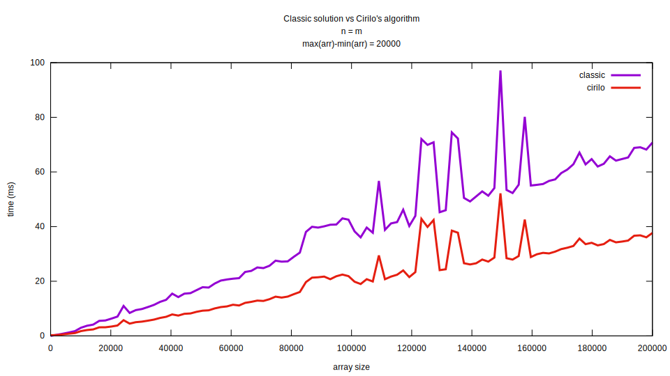

# Cirilo's algorithm
> An overkill algorithm for those in a hurry

The following is a description of a--as far as I know--new solution for the [Smallest Difference pair of values between two unsorted Arrays](https://www.geeksforgeeks.org/smallest-difference-pair-values-two-unsorted-arrays) problem.

## Disclaimer

I'm claiming the following algorithm as mine because I couldn't find it elsewhere. If you've implemented it before me, please let me know.

## The problem

Simply stated, the problem consists of given two arrays of integers, **A** and **B** of size **m** and **n** respectively, find the pair of numbers **(A<sub>i</sub>, B<sub>j</sub>)** with the smallest difference between them.

So, given:

```
A = [1, 12, 150]
B = [32, -20, 11, 8]
```

The solution would be the array:
```
[12, 11]
```

### Classic solution

The solution proposed on GeeksforGeeks and others resources is based on sorting both arrays, and then finding the smallest pair using two pointers logic with linear complexity. The overall solution has a time complexity of **O(m*log(m) + n\*log(n))** and space complexity of **O(1)**.

The solution in pseudocode can be found below:

``` c
find(A, B) {
	A.sort()
	B.sort()

	a = 0
	b = 0

	smallestPair = [A[0], B[0]]

	while (a < A.length && b < B.length) {
		if (abs(A[a] - B[b]) < abs(smallestPair[0] - smallestPair[1]))
			smallestPair = [A[a],  B[b]]

		if (A[a] < B[b])
			a++
		else
			b++
	}

	return smallestPair
}
```

### Cirilo's algorithm

My solution sorts only the smallest array, taking **O(m\*log(m))**. 

After that, it computes and save in a hash map all the smallest possible pairs between every number in the array and all integers between **min(arr)** and **max(arr)**, that being the minimum and maximum value contained in the array. All of that can be done in **O(max(arr) - min(arr))**.

So if, after sorted, we had ``A = [-2, 5, 9, 12]`` we would create the following map:

``` c
[
	-2 -> -2,
	-1 -> -2,
	 0 -> -2,
	 1 -> -2,
	 2 ->  5,
	 3 ->  5,
	 4 ->  5,
	 5 ->  5,
	 6 ->  5,
	 7 ->  5,
	 8 ->  9,
	 9 ->  9,
	10 ->  9,
	11 -> 12,
	12 -> 12
]
```

Where the key are all the integers between **min(arr)** and **max(arr)** and the values are the elements in **A** closest to these numbers.

Finally, for each element on **B** we get from the map the corresponding element on **A** that is closest from it, and, from all those pairs, choose the smallest. That takes **O(n)**.

The final algorithm space complexity is:

**O(m\*log(m) + n + max(A) - min(A))** if the first array is smaller than the second, or:

**O(n\*log(n) + m + max(B) - min(B))** otherwise;

And the space complexity (because of the hash map) is:

**O(max(A) - min(A))** if the first array is smaller than the second, or:

**O(max(B) - min(B))** otherwise;

Pseudocode:

``` c
find(A, B) {
	if (A.length > B.length) {
		tmp = A
		A = B
		B = tmp
	}

	/* O(n*log(n)) */
	A.sort()

	closestMap = findClosestMap(A)

	smallestPair = [A[0], B[0]]
	
	/* O(m) */
	for (int i = 0; i < n; i++) {
		if (B[i] > A[A.length-1]
			currentFromA = A[A.length-1]
		} else if (B[i] < smallestFromA) {
			currentFromA = A[0]
		} else {
			currentFromA = closestMap[B[i]]
		}

		if (diff(currentFromA, B[i]) < diff(smallestPair[0], smallestPair[1])) {
			smallestPair = [currentFromA, B[i]]
		}
	}

	return smallestPair
}

/* O(max(A) - min(A))
 * iterate over every integer between A[0] and A[A.length-1]
 * and maps it to the closest value in A
 */
findClosestMap(A) {
	closestMap = createMap()
	
	for (i = 0; i < A.length-1; i++) {
		closestMap[A[i]] = A[i]

		middle = (A[i] + A[i+1]) / 2;

		for (num = A[i] + 1; num < A[i+1]; num++) {
			if (num <= middle) {
				closestMap[num] = arr[i]
			} else {
				closestMap[num] = arr[i+1]
			}
		}
	}

	closestMap[arr[n-1]] = arr[n-1]

	return closestMap
}


diff(a, b) {
	return abs(a - b)
}
```

## Comparison

The two algorithms are implemented [here](src/algorithms/classic/classic.c "classic solution") and [here](src/algorithms/cirilo/cirilo.c "my solution"). There is also a program that tests one solution against the other, that can be found [here](src/test.c). 

The following is a result of a comparison with random arrays of same size ranging from 2 to 200000, with integers between -10000 to 10000.



## Drawbacks

The most obvious drawback of this solution is the increase on the space complexity, being an example of the space-time trade-off.

It also introduces another variable in both the space and time complexity, the range of numbers in the arrays, the greater the numbers on the arrays get, the slower and heavy the algorithm will run. Making it unusable if there is need to use bignums.

That aside, it is important to acknowledge that it is trivial to make the classic algorithm work with floating-point numbers, which is not possible in the proposed solution.
